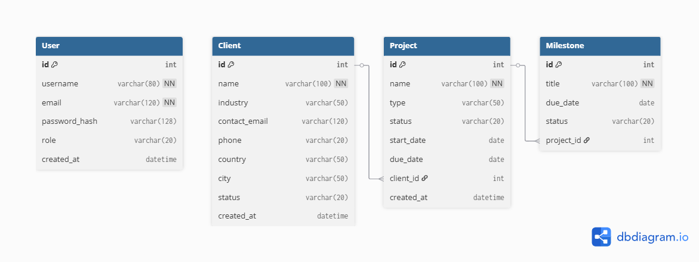

# Schéma de Base de Données - Dashboard Leads

## Diagramme

## Tables

### User
- **id** (Integer, Primary Key, Auto-increment)
- **username** (String(80), Unique, Not Null)
- **email** (String(120), Unique, Not Null) 
- **password_hash** (String(128))
- **role** (String(20)) - admin/manager/viewer
- **created_at** (DateTime)

### Client  
- **id** (Integer, Primary Key, Auto-increment)
- **name** (String(100), Not Null)
- **industry** (String(50))
- **contact_email** (String(120))
- **phone** (String(20))
- **country** (String(50))
- **city** (String(50))
- **status** (String(20)) - prospect/actif/archive
- **created_at** (DateTime)

### Project
- **id** (Integer, Primary Key, Auto-increment)
- **name** (String(100), Not Null)
- **type** (String(50)) - site vitrine/e-commerce/campagne ads
- **status** (String(20)) - planifié/en_cours/en_pause/livré
- **start_date** (Date)
- **due_date** (Date)
- **client_id** (Integer, Foreign Key → Client.id)
- **created_at** (DateTime)

### Milestone
- **id** (Integer, Primary Key, Auto-increment) 
- **title** (String(100), Not Null)
- **due_date** (Date)
- **status** (String(20)) - pending/completed/delayed
- **project_id** (Integer, Foreign Key → Project.id)

## Relations
- **Client 1:N Project** - Un client peut avoir plusieurs projets
- **Project 1:N Milestone** - Un projet peut avoir plusieurs jalons
- **Project N:1 Client** - Un projet appartient à un seul client
- **Milestone N:1 Project** - Un jalon appartient à un seul projet